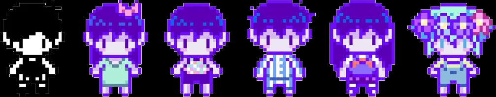

  

  

  

## About Me

<table width="100%">
  <tr>
    <td valign="top">
      

        Hi, I am a university student majoring in cybersecurity.
      

      <ul>
        <li>My primary interests include incident response, binary vulnerability analysis, deobfuscation, and boot system security.</li>
        <li>You can explore my previous projects on my profile.</li>
        <li>Thank you for visiting my little white space.</li>
      </ul>
    </td>
    <td align="right" valign="top" width="96">
      
    </td>
  </tr>
</table>

## Tech Stacks

<table width="100%">
  <tr>
    <td align="left" valign="top" width="96">
      
    </td>
    <td align="center">
      <table align="center">
        <tr>
          <td align="center"></td>
          <td align="center"></td>
          <td align="center"></td>
          <td align="center"></td>
          <td align="center"></td>
          <td align="center"></td>
          <td align="center"></td>
        </tr>
        <tr>
          <td align="center"></td>
          <td align="center"></td>
          <td align="center"></td>
          <td align="center"></td>
          <td align="center"></td>
          <td align="center"></td>
          <td align="center">&nbsp;</td>
        </tr>
      </table>
    </td>
    <td width="96">&nbsp;</td>
  </tr>
</table>

## Contact Me

<table width="100%">
  <tr>
    <td width="96">&nbsp;</td>
    <td align="center">
      <table align="center">
        <tr>
          <td align="center" width="150">
            
             
            <a href="https://www.instagram.com/b4nd59"><strong>@b4nd59</strong></a>
          </td>
          <td align="center" width="150">
            
             
            <strong>higary_</strong>
          </td>
          <td align="center" width="150">
            
             
            <a href="https://b4nda.com"><strong>b4nda.com</strong></a>
          </td>
        </tr>
      </table>
    </td>
    <td align="right" valign="top" width="96">
      
    </td>
  </tr>
</table>

## Stats

  

  

