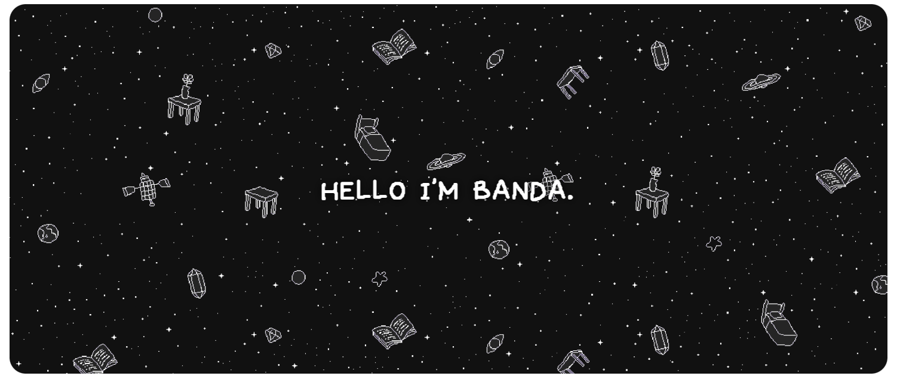
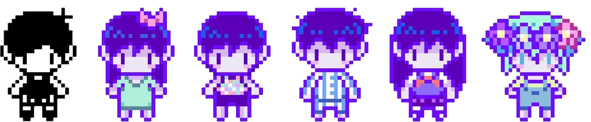
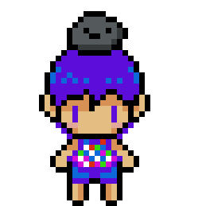
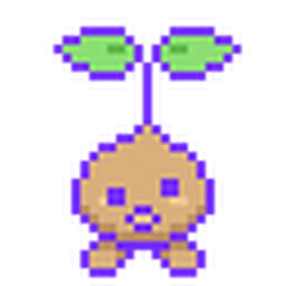
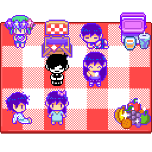

  

  

  

## About Me

Hi, I am a university student majoring in cybersecurity.

- My primary interests include incident response, binary vulnerability analysis,
  deobfuscation, and boot system security.
- You can explore my previous projects on my profile.
- Thank you for visiting my little white space.

  

## Tech Stacks

  
  
  
  
  
  
  

  
  
  
  
  
  

  

## Contact Me

  
  &nbsp;&nbsp;
  
  &nbsp;&nbsp;
  

  <a href="https://www.instagram.com/b4nd59"><strong>@b4nd59</strong></a>
  &nbsp;&nbsp;&nbsp;
  <strong>higary_</strong>
  &nbsp;&nbsp;&nbsp;
  <a href="https://b4nda.com"><strong>b4nda.com</strong></a>

  

## Stats

  

  

